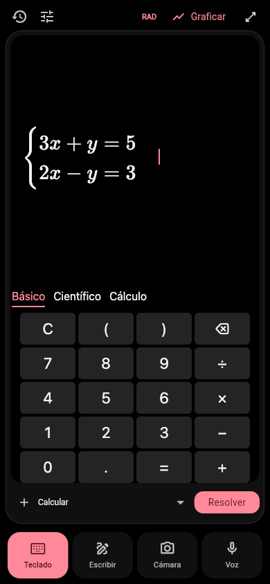
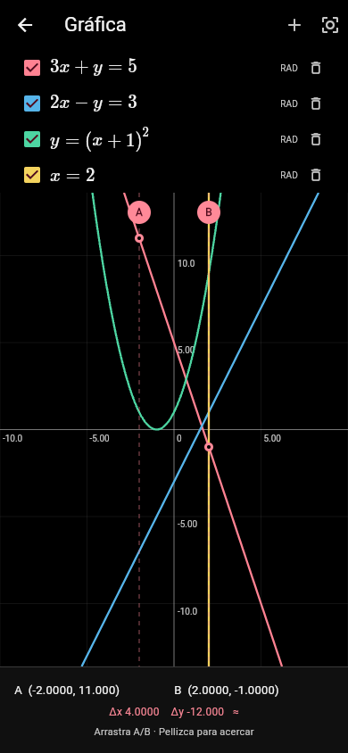
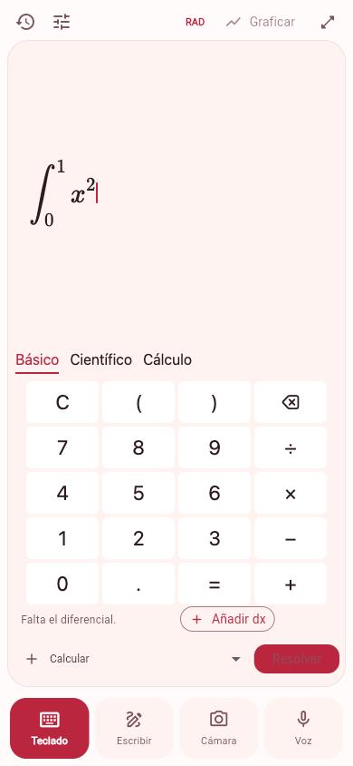
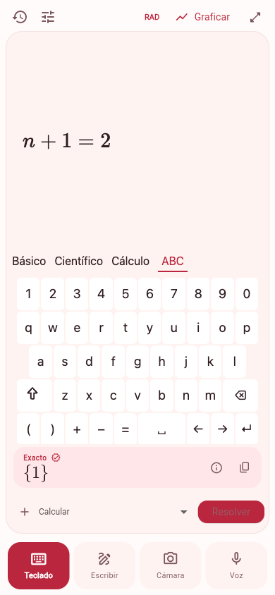
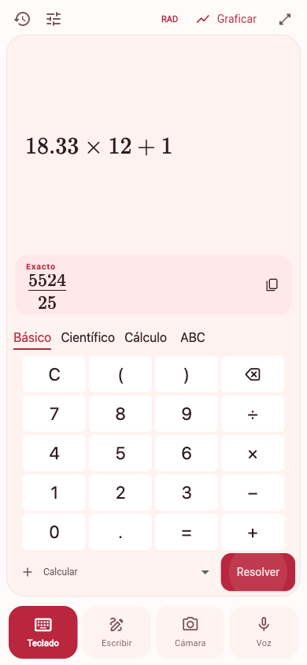
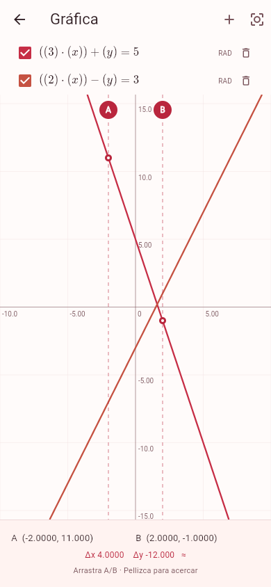

<p align="center">
  
</p>

<h1 align="center">Jem Calc</h1>

<p align="center">
  Calculadora científica para <strong>Android, iOS y web</strong>.<br>
  Escribe, dibuja, fotografía o dicta una ecuación. Revísala y resuélvela.
</p>

<p align="center">
  <a href="https://calc.jemailabs.com">Abrir el piloto privado</a> ·
  <a href="#capturas-y-usos">Capturas y usos</a> ·
  <a href="#ejecutar-el-proyecto">Instalación</a> ·
  <a href="deploy/README.md">Despliegue</a>
</p>


Jem Calc combina una interfaz Flutter con un editor matemático visual, aritmética exacta local, cálculo simbólico mediante SymPy y gráficas interactivas. Comparte la interfaz y el motor matemático entre las tres plataformas, con acentos rojos y temas claro y oscuro. El tema oscuro usa fondo negro y superficies grises neutras; las gráficas distinguen las curvas con rojo, azul, verde y ámbar.

**Los resultados los calcula un motor matemático determinista.** La IA reconoce e interpreta la entrada: propone una expresión editable y el usuario pulsa **Resolver** para calcularla. Un LLM nunca sustituye al motor de cálculo.

El [piloto alojado](https://calc.jemailabs.com) requiere una clave de acceso. Las apps Android/iOS pueden usar `https://calc.jemailabs.com/api` con su token y una conexión a Internet, sin USB ni una Mac encendida. Este repositorio no incluye las credenciales del servicio.

<p align="center">
  
  
</p>

## Completar ecuaciones



El teclado **Cálculo** incluye `dx`, `dy`, `dz` y `dt`. En cualquier modo, la app revisa la estructura de la expresión y muestra acciones cuando reconoce una parte faltante:

- **Añadir dx/dy…**: integral con integrando completo y sin diferencial. Si aparecen varias variables, puedes elegir entre ellas.
- **Cerrar**: paréntesis, corchetes o llaves sin cierre, cuando añadirlo deja una expresión válida.
- **Completar**: espacios vacíos en fracciones, exponentes, funciones, lados de ecuaciones, límites o extremos de una integral. Abre el teclado y selecciona el primer espacio pendiente; tú introduces el valor.

Las sugerencias son reglas locales y deterministas; no llaman a un modelo ni resuelven la operación. El reconocimiento de voz/foto puede emitir avisos adicionales. Una sugerencia solo se aplica al tocarla y nunca inventa números: hay que pulsar **Resolver** para calcular. Al corregir durante el dictado se conserva la sesión y se descartan transcripciones que correspondan a una revisión anterior. En expresiones ambiguas o sintaxis todavía no soportada se conserva el aviso para edición manual.

Con el teclado abierto, **Completar**, **Cerrar** y las propuestas de diferenciales aparecen justo encima de sus pestañas. Las teclas mantienen su posición al aparecer o desaparecer una sugerencia; solo se ajusta el área de la ecuación. Esto también se aplica a la ventana de edición que se abre desde Voz, Cámara o Escribir.

## Capturas y usos

Las capturas muestran la aplicación web real con su paleta roja y ecuaciones de ejemplo; la vista compacta usa un ancho de 390 px. Los cuatro modos de entrada están disponibles desde los botones inferiores.

### 1. Teclado: cálculo científico y simbólico

Introduce fracciones, raíces, potencias y funciones con las pestañas **Básico**, **Científico**, **Cálculo** y **ABC**. Selecciona la operación y pulsa **Resolver** o Enter. La pantalla de la ecuación se puede maximizar. Las teclas `sin`, `cos` y `tan` abren el argumento automáticamente y dejan el cursor dentro; `)` permite continuar fuera de la función. Las teclas pulsadas usan un resaltado suave y legible en el tema claro.

El teclado **Científico** incluye `x`, `y` y `z`. **ABC** abre un QWERTY con letras A–Z, mayúsculas con Shift, números, paréntesis, operadores, espacio, flechas y borrado. Los cuatro teclados mantienen cinco filas para conservar espacio para la ecuación. Las variables son letras individuales; `e` y `π` mantienen su significado como constantes matemáticas. Para derivar o integrar, el selector de variable también ofrece las letras presentes en la expresión, como `a` o `n`.



El resultado aparece **encima del teclado**, junto a la ecuación, y conserva los botones de copiar y consultar su dominio y comprobación. Las teclas mantienen su posición durante el cálculo, al recibir el resultado y al seguir escribiendo o limpiar la pantalla. Los resultados largos se desplazan dentro de su tarjeta; en pantallas pequeñas también puedes desplazar el visor superior para consultar la ecuación.

<p align="center">
  
</p>

- **Calcular** evalúa aritmética racional exacta o aproximaciones numéricas locales.
- Si quedó seleccionado **Resolver**, una expresión puramente numérica también se calcula localmente: `18.33 × 12` da `5499/25`, equivalente a `219.96`. Una igualdad explícita o una expresión con incógnitas conserva la resolución de ecuaciones; las operaciones de cálculo como derivar o integrar siguen respetando la selección.
- **Exacto**, **Simplificar**, **Expandir** y **Factorizar** usan el CAS.
- También puedes resolver ecuaciones, derivar, integrar y calcular límites.
- Cambia entre **RAD** y **DEG** para las funciones trigonométricas.

<p align="center">
  
</p>

### 2. Escribir: ecuaciones a mano

Selecciona **Escribir** y usa el dedo, el lápiz o el ratón. El lienzo incluye deshacer, rehacer, borrador de trazos y modo **Solo lápiz**. Pulsa **Reconocer ecuación** para enviar los trazos a Mathpix; revisa la expresión reconocida antes de resolverla.


### 3. Cámara: fotografiar o cargar una ecuación

Selecciona **Cámara** para capturar una foto o abrir una imagen. Recorta y gira la imagen si hace falta, pulsa **Reconocer** y corrige la propuesta antes de **Resolver**. El reconocimiento de imágenes integrado utiliza Mathpix.


### 4. Voz: dictado con edición

Selecciona **Voz**, concede permiso al micrófono y pulsa **Comenzar dictado**. Puedes decir, por ejemplo, «equis más uno igual a dos». La transcripción y la expresión se actualizan durante la sesión; el botón de teclado junto al micrófono permite corregir la ecuación mientras dictas.

Al terminar, revisa la expresión y pulsa **Resolver**. En Configuración puedes elegir Scribe v2 Realtime o GPT Live Transcribe. La interpretación del dictado usa GPT-6 Luna; el cálculo posterior sigue a cargo del motor determinista.


### 5. Gráficas: funciones y sistemas lineales

Escribe una función como `x^2`, `sin(x)` o `y=x+1`, una ecuación lineal como `3x+y=5`, o un sistema como `3x+y=5;2x-y=3`, y pulsa **Graficar**. El sistema añade cada recta con su propia casilla de visibilidad; también se admiten rectas verticales como `x=2`. No hace falta resolver ni despejar antes: la conversión es local y determinista. Puedes añadir hasta cuatro curvas, desplazar la vista, hacer zoom y arrastrar los cursores **A/B** para consultar coordenadas y diferencias sobre la primera curva visible. Una recta vertical no tiene una altura única para un valor de x; sus lecturas de y aparecen como `—`. Las relaciones implícitas no lineales, como `x^2+y^2=1`, todavía requieren otra representación; las funciones explícitas conservan su dominio y sus discontinuidades.

Las ecuaciones de la leyenda usan notación matemática legible (`3x + y = 5`), con fracciones y potencias y conservando los paréntesis necesarios. Este formato también se aplica a las curvas guardadas, sin modificar sus datos.

La casilla de cada curva permite ocultarla y volver a mostrarla. El pequeño bote de basura la elimina de la gráfica. Usa **+** para volver al editor y añadir otra función. Las coordenadas y valores de la gráfica son aproximados.


<p align="center">
  
</p>

### 6. Historial: recuperar cálculos

El historial conserva expresiones, resultados, operación, modo angular y versión del motor. Toca una entrada para reutilizarla. En pantallas amplias aparece junto al editor; en móvil se abre con el icono de historial.


El historial se guarda en cada dispositivo o navegador. Actualmente no se sincroniza entre ellos; borrar los datos del sitio también elimina su historial.

## Qué funciona sin servidor

| Función | Disponibilidad |
| --- | --- |
| Editor y teclado científico | Local |
| Aritmética racional y evaluación numérica | Local |
| Gráficas e historial | Local |
| Álgebra simbólica, ecuaciones, derivadas, integrales y límites | Servidor SymPy |
| Reconocimiento de escritura e imágenes | Servidor y Mathpix |
| Dictado e interpretación de voz | Servidor y proveedores de voz/IA |

En web, el funcionamiento local se refiere a una sesión con la aplicación ya cargada; no implica que el sitio se pueda abrir por primera vez sin conexión.

## Ejecutar el proyecto

### Requisitos

- Flutter 3.44 con Dart 3.12.2 o compatible con `app/pubspec.yaml`.
- Python 3.11 o posterior.
- Android SDK para Android; macOS y Xcode para iOS.
- Android 24+ / iOS 15+ para la configuración actual.
- Credenciales de los proveedores que quieras utilizar. No son necesarias para el cálculo local ni para el CAS.

```sh
git clone https://github.com/jrterven/jemcalc.git
cd jemcalc
```

### 1. Preparar el servidor de desarrollo

```sh
cd server
python3 -m venv .venv
.venv/bin/pip install -e '.[test]'
cp -n .env.example .env
cd ..
```

Edita `server/.env` y configura un `PILOT_TOKEN` aleatorio y las claves de los proveedores que vayas a usar. El token del piloto es independiente de las claves de Mathpix, OpenAI y ElevenLabs. Los archivos `.env`, `.local/` y las claves privadas están excluidos de Git.

En una Mac, con los dispositivos en una red local accesible:

```sh
server/.venv/bin/python scripts/setup_pilot.py
server/.venv/bin/python scripts/run_pilot.py
```

El primer comando detecta la IP de Wi-Fi, crea un certificado TLS de desarrollo y genera `.local/pilot.json`. También puedes indicar la dirección con `scripts/setup_pilot.py --host DIRECCION_IP`. El segundo inicia el backend HTTPS en el puerto **8443**.

Solo el certificado **público** se copia a los assets de la app. Las claves de proveedores permanecen en el servidor. Consulta [la guía del backend](server/README.md) para configuración manual y detalles de seguridad.

### 2. Android e iOS

En otra terminal:

```sh
cd app
flutter pub get
flutter devices
flutter run -d DEVICE_ID --dart-define-from-file=../.local/pilot.json
```

Sustituye `DEVICE_ID` por el identificador del teléfono o iPad. El primer arranque en debug guarda el token en el almacenamiento seguro del dispositivo. Después puedes ejecutar una compilación de piloto optimizada:

```sh
flutter run --profile -d DEVICE_ID --dart-define-from-file=../.local/pilot.json
```

Las compilaciones profile/release no importan tokens desde Dart defines: conservan el guardado o requieren introducirlo en **Configuración**. Para compilar iOS con tu propia cuenta, selecciona tu equipo de firma en Xcode.

El backend de desarrollo requiere que la Mac siga encendida y sea accesible para las operaciones remotas. Los certificados locales caducan a los 30 días; para renovarlos, mueve `server/.tls` a un respaldo privado, repite la configuración y recompila. Un cambio de dirección IP puede requerir el mismo procedimiento.

### Instalar el APK Android sin herramientas de desarrollo

Desde el teléfono, abre [Instalar Jem Calc para Android](https://calc.jemailabs.com/android). Introduce la clave del piloto si se solicita; al iniciar sesión volverás a la página de instalación. Pulsa **Descargar APK** (versión 1.0.9, compilación 11), abre el archivo y, si Android lo solicita, permite a ese navegador instalar aplicaciones de esa fuente. No requiere depuración USB. Si lo abriste dentro de otra app y no comienza la descarga, abre la página en Chrome.

La app ya apunta al servidor alojado. Introduce el token del piloto facilitado por el administrador en **Configuración → Token del piloto**, guarda los cambios y prueba `x+1=2`. El token nativo es diferente de la clave de acceso de la web y no está dentro del instalador.

El APK release se firma con una clave propia de Jem Calc. Para reproducirlo, configura el archivo privado `app/android/key.properties`:

```properties
storeFile=/ruta/privada/jemcalc-release.jks
storePassword=TU_CONTRASENA_PRIVADA
keyAlias=jemcalc-release
keyPassword=TU_CONTRASENA_PRIVADA
```

Desde `app/`, con los certificados opcionales `assets/pilot/server.pem` y `server.der` guardados temporalmente fuera de los assets para una distribución de producción:

```sh
flutter build apk --release --build-name=1.0.9 --build-number=11 \
  --dart-define=PILOT_URL=https://calc.jemailabs.com/api
```

El resultado es `app/build/app/outputs/flutter-apk/app-release.apk`. La configuración de release no utiliza la firma de debug como alternativa. Conserva una copia privada del keystore y sus contraseñas: las actualizaciones requieren la misma firma y un número de compilación mayor. Las instalaciones anteriores firmadas en debug/profile conservan su firma de pruebas y no se pueden actualizar con esta clave; no las desinstales sin respaldar su historial.

### 3. Web

Con el backend de desarrollo configurado y ejecutándose:

```sh
cd app
flutter pub get
flutter build web --no-web-resources-cdn
cd ..
server/.venv/bin/python scripts/run_web.py
```

Abre **[http://localhost:5187](http://localhost:5187)**. El puerto local asignado es **5187**; comprueba antes que esté libre o pertenezca a Jem Calc:

```sh
lsof -nP -iTCP:5187 -sTCP:LISTEN
```

El proxy escucha únicamente en `127.0.0.1`, verifica el TLS del backend y añade el token en el servidor. **No pases `.local/pilot.json` como Dart defines al compilar web**: el JavaScript generado es público. No expongas este proxy de desarrollo a Internet.

Usa siempre el mismo origen para conservar el historial del navegador. Cámara y micrófono requieren permiso; para servir la app fuera de localhost se necesita HTTPS. MathLive y Cropper están incluidos localmente, sin depender de una CDN. Recompila la web después de cambiar el código compartido.

## Arquitectura

```text
app/                    Flutter: UI, editor, cálculo local, gráficas y almacenamiento
  lib/math/             AST, parser, evaluador y conversión LaTeX
  lib/features/         Teclado, escritura, cámara, voz, gráficas y ajustes
  lib/core/             Estado, API y adaptadores nativos/web
server/                 FastAPI, SymPy y adaptadores de reconocimiento
deploy/                 Docker Compose, Nginx y guía del piloto alojado
docs/                   Contrato matemático, proveedores y validación
scripts/                Desarrollo local, pruebas web, iconos y benchmarks
```

El cliente convierte la expresión a un AST validado. La aritmética local se evalúa en Dart; las operaciones simbólicas se envían al CAS SymPy, ejecutado en procesos aislados con límites de recursos y tiempo. Los resultados distinguen valores exactos, aproximaciones, ausencia de soluciones, errores de dominio, operaciones no soportadas y tiempos agotados.

El reconocimiento de trazos, fotos o voz produce un borrador editable. La revisión de cambios protege las correcciones manuales frente a propuestas de voz tardías.

| Documento | Contenido |
| --- | --- |
| [Contrato matemático](docs/contract.md) | AST versionado, operaciones y transporte |
| [Backend](docs/backend.md) | CAS y conexión con el servidor |
| [Proveedores](docs/providers.md) | Mathpix, voz, interpretación y comparación de reconocimiento |
| [Editor](docs/editor-notes.md) | MathLive y adaptación a las plataformas |
| [Validación](docs/validation.md) | Pruebas realizadas y verificaciones manuales pendientes |
| [Despliegue](deploy/README.md) | Piloto HTTPS, actualización, acceso y reversión |
| [AGENTS.md](AGENTS.md) | Convenciones de desarrollo y compatibilidad entre plataformas |

Algunas evidencias de validación se conservan como archivos locales privados y no se distribuyen en este repositorio.

## Pruebas

Desde `app/`:

```sh
flutter analyze
flutter test
```

Desde `server/`:

```sh
.venv/bin/pytest
```

Para pruebas de navegador, instala Playwright en un entorno local y ejecuta desde la raíz, con la web y el backend activos:

```sh
node scripts/test_web.mjs
node scripts/test_editor.mjs
node scripts/test_graph_systems_web.mjs
node scripts/test_qwerty_web.mjs
node scripts/test_numeric_solve_web.mjs
node scripts/test_completions_web.mjs
node scripts/test_results_web.mjs
```

Los scripts usan Chrome instalado. Si el módulo está en otro entorno, define `PLAYWRIGHT_MODULE` con la ruta absoluta a su `index.mjs`. Los informes y capturas se guardan en `output/playwright/`, excluido de Git.

Las llamadas a proveedores son opcionales y pueden generar cargos: actívalas con `WEB_TEST_PROVIDERS=1` y `WEB_TEST_AUDIO=/ruta/ecuacion-sintetica.wav`. Usa una grabación de «equis más uno igual a dos» seguida de al menos ocho segundos de silencio. El navegador de pruebas utiliza cámara y micrófono sintéticos.

`scripts/benchmark_providers.py` permite comparar reconocimiento con un corpus etiquetado; solo realiza llamadas al añadir `--run`. Las pruebas de integración no equivalen a un estudio de precisión sobre una población de usuarios.

## Alcance del piloto

El CAS admite ecuaciones reales de una variable, sistemas lineales de hasta cuatro variables, sistemas polinómicos cuadráticos de dos variables, derivadas hasta orden tres, integrales de una variable y límites laterales o bilaterales. Para sistemas, separa las ecuaciones con `;` o utiliza una expresión `cases`. Una expresión sin resolver no significa que no existan soluciones.

Todavía no incluye cuentas individuales, sincronización, publicación en tiendas, explicaciones paso a paso, aritmética compleja, matrices generales, ecuaciones diferenciales, gráficas implícitas no lineales/3D ni integración con Wolfram. Las pruebas de lápiz físico, accesibilidad y rendimiento sostenido requieren revisión manual.

## Identidad visual y dependencias

El logo maestro está en [`app/assets/brand/jem-calc-logo.png`](app/assets/brand/jem-calc-logo.png). Para regenerar los iconos Android, iPhone/iPad, favicon e iconos de instalación web, ejecuta en macOS:

```sh
node scripts/sync_brand_icons.mjs
```

La paleta roja compartida está en [`app/lib/core/palette.dart`](app/lib/core/palette.dart); los adaptadores MathLive reciben esos mismos colores. Los cambios deben mantenerse compatibles con Android, iOS y web.

MathLive 0.111.0 y Cropper se distribuyen con sus respectivas licencias en sus directorios. Las dependencias Flutter están fijadas en `app/pubspec.lock` y el snapshot de dependencias Python está en `server/requirements-lock.txt`.
